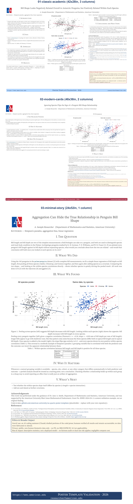

# Quarto Conference Posters

**Full documentation: <https://au-datascience.github.io/poster_templates/>**

> **Heads up:** Quarto's `_brand.yml` theming and its `poster-typst` extension are both still under active development upstream. The [Notes / gotchas](https://au-datascience.github.io/poster_templates/scripts-and-ci.html#notes-gotchas) page describes current rough edges (local patches, path handling, caching) that a future Quarto/Typst release may resolve outright.

A modern replacement for the `posterdown`/R Markdown poster workflow. There are three templates; each a single `.qmd` file that renders to **two** outputs -- a large-format print PDF via [Typst](https://typst.app), and a responsive HTML "web poster" -- from the same content in one pass.

## Quickstart

1. Fork or clone this repo.
2. Copy one of the `templates/*/` folders (e.g. `cp -r templates/01-classic-academic templates/my-poster`) and edit its `poster.qmd`.
3. `quarto render templates/my-poster/poster.qmd` -- check `poster.pdf` and `poster.html`.
4. `Rscript scripts/render-all.R` to render + check every template for known regressions before you call it done.

The full walkthrough (including re-coloring for a different organization, choosing a print size for a specific conference, and what each script/CI check does) is on the [documentation site](https://au-datascience.github.io/poster_templates/) -- start on the [Home](https://au-datascience.github.io/poster_templates/) page.

## Site map

| Page | Covers |
|---|---|
| [Home](https://au-datascience.github.io/poster_templates/) | Repo structure, forking and building your own poster |
| [Templates](https://au-datascience.github.io/poster_templates/templates.html) | The three template designs, and choosing a print size |
| [Content Guide](https://au-datascience.github.io/poster_templates/content-guide.html) | The Ethics & Broader Impact panel, shared resources (`_brand.yml`, `references.bib`, logo) |
| [Theming & Brand](https://au-datascience.github.io/poster_templates/theming.html) | Re-coloring the templates and WCAG contrast auditing; how `_brand.yml` fits in |
| [Scripts & CI](https://au-datascience.github.io/poster_templates/scripts-and-ci.html) | The R build/check scripts, the `Makefile`, continuous integration, and Notes / gotchas |
| [Why Typst?](https://au-datascience.github.io/poster_templates/why-typst.html) | Why print renders through Typst instead of LaTeX, and the trade-offs |

This site (`docs/`) is itself a nested Quarto website project, published to GitHub Pages by [`.github/workflows/docs.yml`](.github/workflows/docs.yml) -- separate from [`.github/workflows/posters.yml`](.github/workflows/posters.yml), which renders and checks the poster templates.
