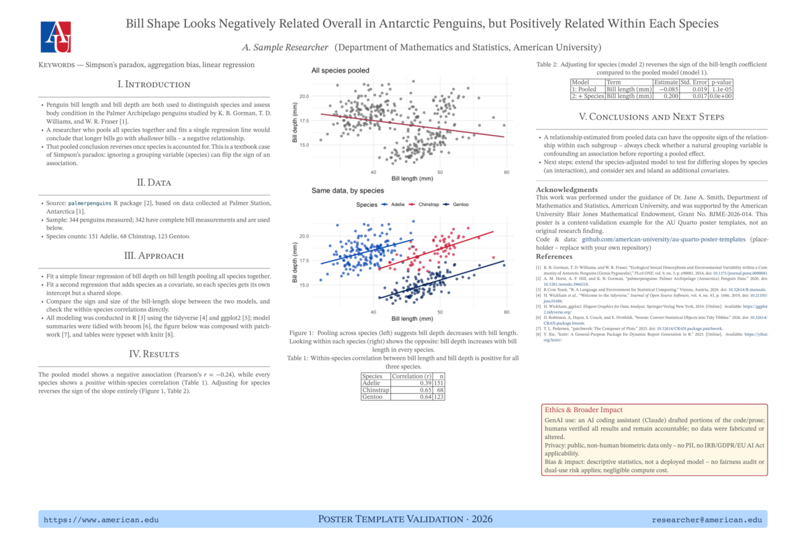
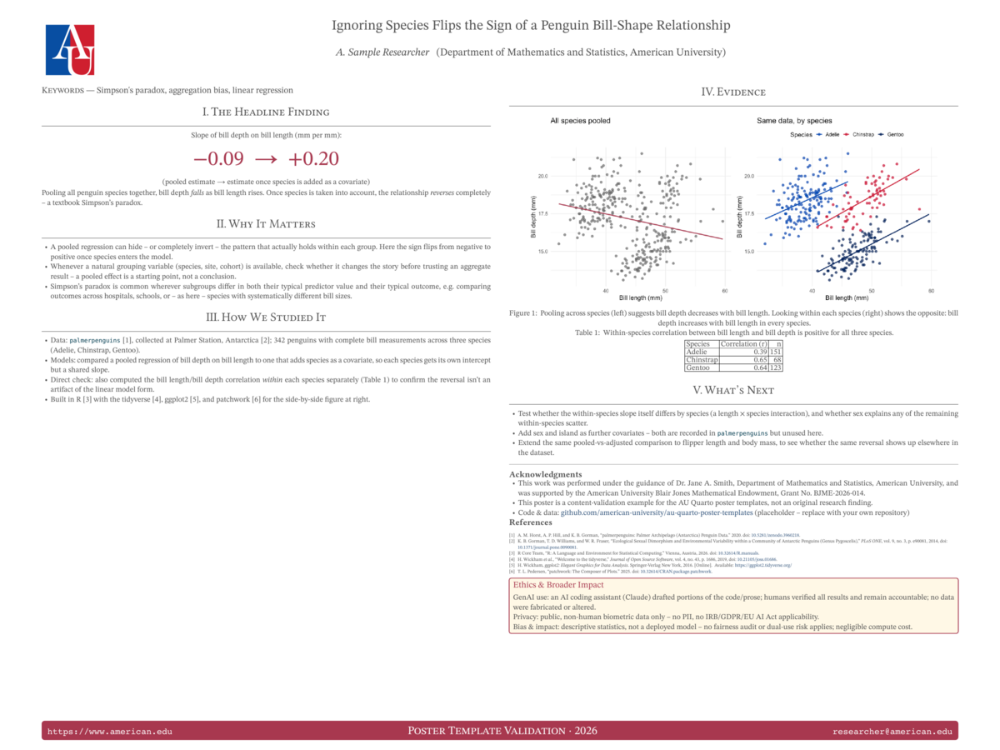
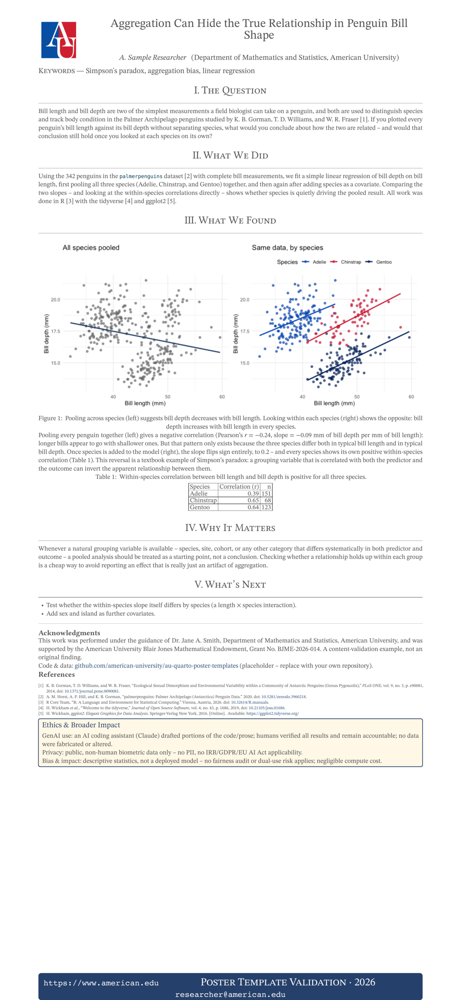

# Quarto Conference Posters

A modern replacement for the `posterdown`/R Markdown poster workflow. There are three templates; each a single `.qmd` file that renders to **two** outputs:

| Format          | Purpose                | Engine |
|------------------------|--------------|--------|
| `poster-typst`  | Large-format print PDF (e.g. 36x24 in)     | [Typst](https://typst.app), via the `quarto-ext/typst-templates/poster` extension |
| `html`          | Responsive, scrollable "web poster" for posting online | Quarto HTML + custom SCSS |

- Because both formats are declared in one `format:` block, `quarto render poster.qmd` builds *both* versions from the same content in one pass. 
- Run `quarto render poster.qmd --to poster-typst` or `--to html` to build just one.
- The print PDF is typeset by **Typst**, not LaTeX. That choice drives several things in these templates (raw `` ```{=typst} `` blocks, arbitrary page sizes, no TeX install) -- see [Why Typst instead of LaTeX?](#why-typst-instead-of-latex) at the end for the reasoning and the trade-offs.
- `Rscript scripts/render-all.R` renders all three templates and then checks the output for known regressions -- see [Build & check scripts](#build--check-scripts).

## Templates

The three templates offer different design approaches that may be tailored for a particular purpose. 

- All three share the same content structure (level-2 `##` headings become poster sections/panels automatically) so switching between them is mostly a matter of swapping the YAML/SCSS, not rewriting your text.

1. **`templates/01-classic-academic/`**: traditional 3-column layout (Intro / Methods / Data / Results / Conclusions), serif headings, the closest analog to the old posterdown betterland template. 
    - Print size 42x28 in, 3 Typst columns.

   

2. **`templates/02-modern-cards/`**: dashboard-style card grid with a bold accent color and a `.stat` class for headlining one big number.
    - Print size 48x36 in, 2 Typst columns (fewer, larger panels). 
    - This size doubles as a standard conference board size -- see "Choosing a print size" below.
    - This template's content was originally short enough that Typst never started the second column at all (everything landed in column 1, leaving column 2 blank except the floated Ethics panel). Fixed by adding a manual `#colbreak()` (raw Typst, right before `## Evidence`) so the figure/table/"What's Next" content explicitly starts column 2, plus enough added text/a correlation table to make the two columns' content roughly comparable to `01-classic-academic`'s. 
    - The figure itself was always full *column* width -- if you add your own full-page figures, note that `out-width: "100%"` measured against the *page* width rather than the current column's width immediately after a `#colbreak()` in local testing, overflowing past the margin; setting an explicit absolute `out-width` (e.g. `"20in"`) sidesteps it.
    - The `.stat` class only exists in the web stylesheet, so the headline number is written **twice** -- a `` ```{=html} `` block carrying `<div class="stat">` and a `` ```{=typst} `` block setting the same number at 72pt. Without the second half it silently prints at body size. Inline `` `r ... ` `` code is evaluated inside both raw blocks, so the number itself still comes from the fitted model, not a hardcoded string.
    - Only this template has a headline stat. `01-classic-academic` and `03-minimal-story` are deliberately left without one -- a classic multi-section poster and a running narrative have no single number to feature -- so there is nothing to style there. If you add a stat to either, copy *both* blocks and add a `.stat` rule to that template's `*-web.scss`.

   

3. **`templates/03-minimal-story/`**: a single flowing narrative column, meant to be read like a short article; flat design, generous whitespace. 
    - Print size 24x52 in (portrait banner), 1 Typst column.

   

Each preview above (`images/previews/preview-*.png`) is a 1200px-wide PNG rendered from that template's own `poster-typst` PDF. Neither these nor `comparison.png` below are produced by `quarto render`; regenerate both with `Rscript scripts/make-previews.R` after a content change (render the PDFs first).

All three are currently filled in with the *same* worked example (a Simpson's-paradox analysis of bill shape across penguin species, using `palmerpenguins`) so the three visual styles are directly comparable:


- `comparison.png` stacks the three posters as separate full-width rows (labeled with the template name/size) using the R `magick` package.
  - Rows, not side-by-side columns: `03-minimal-story` is a tall 24x52in portrait banner, while the other two are landscape (42x28in, 48x36in); scaling all three to a common *height* for a side-by-side layout shrinks the banner to an unreadable sliver, so each poster instead gets its own row at a common *width*, sized for legibility.
  - Each page is rasterized at 2x its target pixel width and downsampled, rather than rendered at full 300 dpi print resolution first -- a 48x36in page at 300 dpi is a 14400x10800 bitmap, and the supersampled version is indistinguishable at README display sizes for a fraction of the memory.
  - `03-minimal-story`'s header grid (logo/title column widths) defaults to values sized for wider posters, so its long title overflowed the page margin at the default `title-font-size`. Fixed by setting `univ-logo-column-size: 3`, `title-column-size: 16`, `title-font-size: 44`, and `authors-font-size: 28` in that template's YAML (its 24in width leaves only 20in inside the page's 2in margins, vs. the extension's 10in + 20in defaults).

A lesson from filling in the templates: **the single-column minimal-story layout has noticeably less capacity per page than the 2- or 3-column layouts.** With this same content, it initially overflowed onto a second Typst page at `24x36in`;

- The version here (with a per-species correlation table and a "What's Next" section added, to use the extra room well rather than leave it blank) needs `24x52in` to stay on one page. 
- If you adapt this template with less content than that, you can size it down; budget less text per page than you would for the classic or modern-cards versions either way.

## Choosing a print size

`size:` (under `poster-typst:` in each template's YAML) takes any Typst-compatible `"WIDTHxHEIGHT"` in inches -- it isn't tied to a specific venue. 
- A few sizes recur often enough at ML/data-science conferences that it's worth calling out how the templates map onto them (all landscape, given as the venue's own H x W convention next to the equivalent `size:` string):

| Venue / convention | H x W | `size:` string |
|---|---|---|
| 3ft x 4ft (a common poster-board default) | 36in x 48in | `"48x36"` |
| ICML | 36in x 48in (91cm x 121cm) | `"48x36"` |
| NeurIPS (narrower boards) | 36in x 60in | `"60x36"` |
| NeurIPS (wider boards) | 36in x 72in | `"72x36"` |

`02-modern-cards` already ships at `"48x36"`, so it's ready for either the generic 3ft x 4ft board size or ICML as-is. 

- To target a different size (e.g. NeurIPS), on any template:

1. Change `size:` to the `size:` string from the table (or any other `"WxH"` you need).
2. If the aspect ratio changes a lot (e.g. going from 48x36 to 72x36), reconsider `num-columns` -- wider boards generally read better with one more column than a narrower version of the same layout.
3. Re-render (`quarto render poster.qmd --to poster-typst`) and check for overflow onto a second page or, conversely, excess blank space;
  - Adjust `body-font-size`, trim/add content, or nudge `size:` again as needed. 
  - `01-classic-academic` and `03-minimal-story` aren't currently tuned to any of the sizes above, so budget an iteration or two if you retarget them.

## Ethics & Broader Impact panel

Each template includes an **"Ethics & Broader Impact"** section, placed directly after the methodology section (Approach / How We Studied It / What We Did), covering the three disclosures increasingly expected at AI/data-science venues:

- **Generative AI use** -- which tool was used, for what (code scaffolding, prose editing, citation formatting), and a statement that the human author(s) remain fully accountable and that GenAI was not used to fabricate or alter the underlying data.
- **Privacy & data governance** -- whether the data contain PII, whether IRB/GDPR/EU AI Act provisions apply, and under what approvals the source data were collected.
- **Bias, fairness & broader impact** -- whether a fairness audit or dual-use/weaponization risk assessment applies, and the computational/environmental cost of the analysis.

The included text is accurate for *this* demo (public, non-human `palmerpenguins` biometric data; a simple linear regression, not a deployed model) -- treat it as a worked example of the *kind* of specific, honest statement expected, not boilerplate to copy verbatim. Rewrite each statement for your own project's actual data, models, and tool use.

The panel is implemented once per format so it renders correctly in both:

- **HTML:** a `::: {.ethics-panel} :::` div (defined in `poster-common.scss`) -- a shaded box with a colored border and ~1.35rem text, larger than surrounding body text for readability.
- **Print (Typst):** a raw ```` ```{=typst} ```` block using `#block(..., breakable: false)` for the same shaded/bordered look at 20-24pt. 
- `breakable: false` is required -- without it, Typst can split the block awkwardly across a column break.

Both copies are wrapped in `::: {.content-visible when-format="..."} ` so only one appears in each output; if you edit the disclosure text, update both copies.

**Acknowledgments** are now a plain, uncited sentence for funding and mentorship credit, 

- This work was performed under the guidance of Dr. Jane A. Smith, Department of Mathematics and Statistics, American University, and was supported by the American University Blair Jones Mathematical Endowment, Grant No. BJME-2026-014.

Each template also has a placeholder **Code & data** line near Acknowledgments with a GitHub URL to replace with your own repository.

**References**, Data/software citations appear here automatically when they're cited in-text with `[@key]` earlier in the poster . A ready-to-edit example is included in each template.

## Shared resources

- **`_brand.yml`**: shared AU color palette and typography. Referenced implicitly by Quarto's HTML theming.
  - Edit this once to re-color all three templates. 
  - The `logo:` key is intentionally omitted (see the comment in the file) because each template places the org logo explicitly instead, to avoid a duplicated automatic brand logo.
- **`references.bib`**: shared bibliography. Each poster's YAML sets `bibliography: ../../references.bib`.
  - Entries only appear in the rendered References section if actually cited in the text with `[@key]` (no blanket `nocite: | @*` is used in the filled-in templates, so unused entries stay out of the list). 
  - It includes citations for every R package a template's code actually calls with `library()`generated from each package's own `citation()` output, plus R itself. 
  - If you add a package to a poster's code, add its `citation("pkgname")` entry here too and cite it.
- **`scss/poster-common.scss`**: base tokens and shared "poster shell" rules for the web/HTML version.
- This includes: title banner, section card styling, the automatic `section.level2` → poster-panel behavior. 
- Each template's own `*-web.scss` file is loaded *after* this one and only overrides the grid layout and a few accent details so all three can share this file, or you can point a new template at a different base if you want a fully distinct look.
- **`images/au-logo-hires.png`** — organization logo. Used two ways:
  - Print (`poster-typst`): passed via `institution-logo:` in the format options; the extension places and sizes it automatically (tune with `univ-logo-scale` / `univ-logo-column-size`).
  - Web (`html`): included directly in the `.qmd` inside a `::: {.content-visible when-format="html"}` block, styled by the `.poster-logo` class in `poster-common.scss`.

## Re-coloring the templates

If you fork this repo for another organization, the palette lives in a small number of places -- and `check-contrast.R` exists so you can *prove* your new colors are still accessible rather than assume it:

1. **`scss/poster-common.scss`** -- the `$au-*` tokens under `scss:defaults` drive the whole web version.
2. **`_brand.yml`** -- the same palette for Quarto's brand-aware theming. Keep the two in sync; some Bootstrap variables come from here rather than from the stylesheet.
3. **Print footers are per template** -- `footer-color` and `footer-text-color` in each `poster.qmd` YAML.

Then re-run the audit:

```bash
Rscript scripts/check-contrast.R                 # fails below WCAG AA
Rscript scripts/check-contrast.R --require-aaa   # fails below AAA
```

It parses your new hex values out of the stylesheet and each template's YAML and re-measures every pair, so the check follows your colors instead of the ones committed here. `render-all.R` runs it as part of the full suite.

Four things that catch people out, all covered by the script:

- **The banner is a gradient.** Text over it has to clear the threshold against the *lighter* stop, not just the dark one. Auditing only the dark stop is exactly what hid the original author/date failure (6.97:1 on navy, 3.59:1 on the blue stop). The script reads both stops out of the `linear-gradient()` declaration and checks each separately.
- **The gradient's light stop is capped by its text, not by taste.** White normal-size text needs 7:1 for AAA, which puts a hard ceiling on how light `$au-blue-banner` can be -- hence a dedicated token rather than reusing `$au-blue`. Note the label originally used a dimmed tint, and a *tinted* label is still normal-size text, so AAA would have demanded 7:1 of the tint and forced the light stop nearly to navy, flattening the gradient. The labels are plain white instead and read as secondary through case, tracking, and weight, which keeps about half the gradient's luminance range.
- **Opacity silently undoes contrast.** Quarto's own stylesheet sets `opacity: .8` on `.quarto-title-meta-heading`. Left in place, white at 80% over the light stop composites to roughly `#d6dee7` and measures 5.31:1 -- AA, not the 7.21:1 the color alone suggests. `poster-common.scss` overrides it back to `opacity: 1`; if you introduce translucency anywhere, remember the audit reads declared colors, not composited ones.
- **Accent colors and text colors are held to different bars.** WCAG asks 3:1 of large text and graphics, but 4.5:1 (AA) or 7:1 (AAA) of normal-size text. `$au-blue` is perfectly fine as a banner and border color yet was not fine as link text, which is why `$au-blue-text` exists as a separate darker token -- links can darken without darkening the banner. Size is the other lever, and the script reads each rule's declared `font-size` rather than taking anyone's word for it: a heading at 24px or more (1.5rem at the default root size) is audited as large text automatically, which is how `02`'s red headings reach AAA without touching the red. Shrink such a heading back below 24px and the audit silently re-classifies it as normal text and the stricter bar returns.
- **Inline code inherits the brand grey.** Bootstrap derives `--bs-code-color` from it, so `$au-grey` sets both the acknowledgments/references block *and* every `` `inline code` `` span. These templates use a lot of inline code, so that pair is audited explicitly.
- **Rule colors are parsed, not restated.** The script reads the `color:` and `background:` declarations straight out of the four stylesheets (resolving palette variables and gradient stops), so editing a rule such as the ethics panel's cream background is picked up automatically. Its `source` column shows where each value came from. The exceptions are Bootstrap-derived variables (`--bs-body-color`, `--bs-code-color`, `$link-color`), which no rule states; those resolve from the palette instead.
- **Renaming a class breaks the audit loudly.** A lookup that finds no matching selector or property is a hard error naming the failed selector, not a silently skipped row -- so the audit cannot quietly stop covering something you renamed.
- **A rule that matches nothing gets no row.** `.ethics-panel h2, .ethics-panel h3` is defensive styling with no counterpart in the rendered HTML: the panel's leads are `**bold**` (so `<strong>`, not a heading), and the section's own `h2` is a *sibling* of the panel div rather than a descendant. Auditing it would have reported a contrast figure for text that never appears. If you do put a heading inside the panel, add the row.

Current status: **all 22 audited pairs reach AAA.** The last AA-only pair was `02-modern-cards`'s red section headings on white (6.28:1 against a 7:1 bar); raising them from 1.1rem to 1.5rem makes them large text, where the bar is 4.5:1, which was preferable to darkening the brand red. Because every pair now clears AAA, `--require-aaa` is a usable gate rather than an aspiration -- CI runs it that way.

## Adding your own poster

1. Copy one of the three `templates/*/` folders (or start a new one).
2. Edit the YAML: title, authors/affiliations, `poster-authors`, `departments`, footer contact info, and pick a print `size` (Typst accepts any `"WIDTHxHEIGHT"` in inches).
3. Replace the `##` sections with your own content. Cite sources with `[@bibkey]` and add entries to `references.bib`.
4. `quarto render poster.qmd` — check `poster.pdf` for the printable version and `poster.html` for the web version.

## Build & check scripts

`scripts/` holds three R helpers. All expect to be run from this directory (the one with `_quarto.yml`), and all are optional -- a plain `quarto render` still works.

| Script | What it does |
|---|---|
| `render-all.R` | Renders every template to both formats, then runs every check below (including delegating to `check-contrast.R`) -- one command for the whole suite. Exits non-zero on failure, so it can be wired into CI or a pre-commit hook. Pass `--no-render` to check existing output without re-rendering. |
| `check-column-balance.R` | Measures how far down each Typst column the content actually reaches. Usable standalone: `Rscript scripts/check-column-balance.R templates/<name>/poster.pdf <num-columns>`. |
| `make-previews.R` | Regenerates `images/previews/preview-*.png` and `comparison.png` from the rendered PDFs. |
| `check-contrast.R` | Audits every foreground/background pair in the output against WCAG AA and AAA. Parses the palette, the stylesheets' own `color:`/`background:` rules (including both `linear-gradient()` stops), and each template's print footer YAML, so a re-color is re-audited rather than checked against a stale copy. Fails below AA, or below AAA with `--require-aaa`. See [Re-coloring the templates](#re-coloring-the-templates). |

`scripts/templates.R` is the shared registry of templates (column counts, print sizes, expected column-fill baselines) that the other two read, so adding a template is a one-line edit there.

Every check in `render-all.R` exists because that failure actually happened once and was **invisible in the render log**:

- **pages** -- a content edit overflowing onto a second Typst page; a poster must be exactly one page.
- **divider** -- the web section divider disappearing from the HTML.
- **acknowledgments** -- the raw-HTML-in-a-conditional-div bug described under Notes / gotchas, which dropped the acknowledgments, grant number, and References heading from print while the web version looked perfect.
- **ethics** -- the Ethics & Broader Impact panel missing from either format (it is written once per format, so it can go missing from one).
- **balance** -- a column emptying out relative to its measured baseline.
- **`#### after show rule`** -- a `####` heading placed *above* the level-3 show rule described under Notes / gotchas. Typst show rules only affect what follows them, so such a heading silently keeps the package's "1) Heading:" run-in style.
- **contrast** -- a palette edit dropping a color below WCAG AA, delegated to `check-contrast.R` so the same audit stays usable on its own.

### Continuous integration

`.github/workflows/posters.yml` runs these same scripts on push and pull request, in two deliberately separate jobs:

| Job | Runs | Why it is separate |
|---|---|---|
| `contrast` | `check-contrast.R --require-aaa` | Pure source parsing -- no Quarto, no fonts, no rendering -- so it is quick and its verdict is unambiguous. Every pair currently reaches AAA, so the strict gate is the meaningful one. |
| `render` | `render-all.R` (both formats for all three templates, plus every output check) | Needs the Typst toolchain and system libraries for `pdftools`/`magick`, which are the fragile parts. Keeping them apart means a toolchain or font problem is never mistaken for an accessibility regression. |

See [HANDOFF-fonts-and-ci.md](HANDOFF-fonts-and-ci.md) for the open questions on fonts and this workflow, including a first-push checklist.

Two caveats worth knowing before you rely on it:

- **This workflow has never run.** The project is not a git repository yet, so nothing has exercised it. Treat it as a starting point to verify on the first push, not as a proven pipeline.
- **Fonts change layout, and layout is measured.** `poster.typ` asks for `STIX Two Text`, which macOS ships and an Ubuntu runner does not; Typst falls back silently instead of failing. A fallback face re-breaks lines, which moves the pixel-measured column-fill numbers, so a balance failure that appears only in CI most likely indicates the font rather than the content. The workflow installs `fonts-stix`, which may not include that exact face.

## Notes / gotchas

- The vendored `_extensions/quarto-ext/poster` has three local patches. If you re-install/update the extension, re-apply all three:
  - `poster.typ` accepts the institution logo as already-loaded Typst `content` (loaded once in `typst-show.typ`) rather than a bare path string, because Typst packages cannot read files outside their own package directory (see the `_univ_logo_img` handling in `typst-show.typ`).
  - `poster.typ` / `typst-show.typ` add a `footer-text-color` format option (defaults to white) so the footer text stays legible against
    dark `footer-color` values -- set it to a dark color if you pick a light footer background (see `01-classic-academic`'s `footer-text-color: "25406A"`).
  - `biblio.typ` (a new template-partial, registered in `_extension.yml`) sets `title: none` on the generated `#bibliography(...)` call, so Typst's own default "Bibliography" heading doesn't duplicate each template's own `#### References` heading.
  - Because Quarto caches the vendored local Typst package under each project's `.quarto/typst/packages/local/typst-poster/`, edits to `poster.typ` only take effect after that cached copy is refreshed (delete `.quarto/` or copy the updated file over it) -- a plain `quarto render` will silently keep using the stale cached version.
- Every template's `poster-typst` format sets **`fig-format: png`**. Without it, Typst's default (`fig-format: svg`) asks R's Cairo graphics device to render each plot, which can fail with a missing X11/Cairo shared-library error on machines without XQuartz (common on Apple Silicon macOS, and on Linux without `libcairo2-dev`).
    - Installing XQuartz/`libcairo` dev packages fixes it at the source; `fig-format: png` sidesteps it by using R's built-in PNG device instead, at a small cost in image sharpness for print.
- **Never put a raw `<hr>` (or other raw HTML) inside a `::: {.content-visible when-format="html"}` div.** Doing so silently discards *every element after it* in the Typst output -- the templates lost their section divider, the entire Acknowledgments block (advisor, grant number, code/data link), and the `#### References` heading from the printed PDF, while still rendering fine on the web. Use a ```` ```{=html} ```` raw block instead, which HTML picks up and Typst ignores cleanly.
- **Column balance:** the shipped samples do not fill their columns evenly, and that is accepted slack rather than a bug -- `02-modern-cards` reaches ~44% down column 1 vs ~82% down column 2, and `03-minimal-story` ends ~79% down its single column. The Evidence figure is one ~10in-tall indivisible block, so moving `02`'s `#colbreak()` past it only inverts the gap (measured 91%/29%, a wider spread). Real content is the remedy. Baselines live in `scripts/templates.R`; `render-all.R` fails on a *drop* of more than 10 points from them.
- **Web banner contrast:** the title banner is a gradient, so banner text must clear its *lighter* stop, not just the dark one. The original `$au-light-blue` author/date color measured 6.97:1 on navy but only 3.59:1 on the `$au-blue` stop -- a WCAG AA failure. All banner text is now plain white on a darkened light stop (`$au-blue-banner`, 7.21:1), and link and grey body text were darkened to clear AAA too. See [Re-coloring the templates](#re-coloring-the-templates), and run `Rscript scripts/check-contrast.R` after any color change.
- **`####` headings arrive as Typst level *3*, not level 4.** Quarto maps markdown `##` to `=`, shifting every heading up one level, so the closing-matter headings land on the poster package's level-3 style: a numbered, italic, colon-terminated run-in that prints as "1) Acknowledgments:" and reads like a numbered list item. Each template overrides this with a `#show heading.where(level: 3)` rule in the raw Typst block just above `#### Acknowledgments`, defined *after* the package's own `show heading` rule so it takes precedence. A `####` heading placed earlier in the poster still gets the package's run-in style, since Typst show rules only apply to content after them.
- **Font-size hierarchy is not automatic.** The poster package defaults `title-font-size` to 48pt and `authors-font-size` to 36pt, and derives level-1 headings as `body-font-size + 16`. If you shrink `title-font-size` to fit a long title (as `03-minimal-story` needs to at 24in wide), lower `authors-font-size` too and keep the title above `body-font-size + 16`, or the author line and section headings will print *larger* than the title.
- `.quarto/`, rendered `*.pdf`/`*.typ`/`poster.html`, and `*_files/` directories are gitignored as build output.

## Why Typst instead of LaTeX?

The print format here is [`poster-typst`](https://quarto.org/docs/output-formats/typst.html), which typesets through [Typst](https://typst.app) rather than through LaTeX (`format: pdf`). Quarto's [Typst Basics](https://quarto.org/docs/output-formats/typst.html) guide is the reference for everything in this section.

**Why it fits posters well:**

- **No TeX toolchain.** Quarto ships the Typst CLI, so nothing beyond Quarto itself needs installing -- no TinyTeX bootstrap, no per-package downloads on first render, no version drift between machines. For a template repo other people are meant to clone and render, this is the single biggest practical win.
- **Fast, legible iteration.** Typst is designed to be as capable as LaTeX while being easier to learn, and it renders quickly -- which matters here, because tuning a poster is a loop of "render, look at the whole page, adjust a size, render again."
- **Arbitrary page geometry is a first-class option.** `size: "48x36"` (or `"24x52"`) is just a format option; multi-column flow is `num-columns`. Getting the same from LaTeX means `tikzposter`/`beamerposter` plus a class-specific idiom for every layout decision.
- **Escape hatches that read like code.** The few things Markdown can't express are written as raw `` ```{=typst} `` blocks: `#colbreak()` to force a column, and `#place(bottom + right, scope: "parent", float: true)` to pin the Ethics panel to the physical page corner from inside a column. Both are a couple of legible lines. See [Raw Typst](https://quarto.org/docs/output-formats/typst.html#raw-typst) and the [Typst tutorial](https://typst.app/docs/tutorial/).
- **Inspectable intermediate.** `--metadata keep-typ=true` preserves the generated `.typ`, which is how the dropped-acknowledgments bug in Notes / gotchas was actually diagnosed: the content was missing from the `.typ`, which located the fault in the Markdown, not in Typst.

**What it costs, honestly:**

- **A younger ecosystem.** The vendored extension needed three local patches (see Notes / gotchas) for things a mature LaTeX poster class would already handle. Quarto's own [Known Limitations](https://quarto.org/docs/output-formats/typst.html#known-limitations) note that default image sizing may not match other formats -- which is exactly the `out-width` surprise documented above.
- **Raw blocks are format-locked.** A `` ```{=typst} `` block is invisible to HTML and vice versa, so genuinely dual-format content (the Ethics panel, the headline stat) has to be written twice and kept in sync by hand.
- **Different figure and citation defaults.** Typst output defaults to `fig-format: svg` (these templates override it to `png`, see Notes / gotchas) and uses Typst's own bibliography engine rather than Pandoc's citeproc, which is why suppressing its automatic "Bibliography" heading needed a template partial.
- **LaTeX is still the right call if** you need a specific journal/venue LaTeX class, heavy LaTeX-only math or TikZ, or a collaborator's existing `.tex` workflow.
